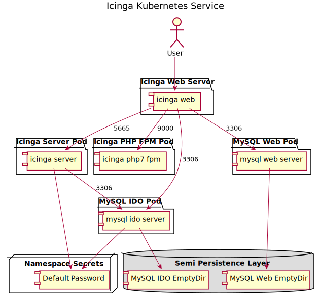

# Intro

This is Icinga designed for Kubernetes instead of Docker Compose.

## Updating Versions

Unfortunately, the build on arm using buildkit fails with GitHub actions.
Therefore, to update to a new version of Icinga, update the `/docker/build.sh`
file with the new versions. Then merge the changes and run the script on an arm
based system.

## Deployment



## Local

1. Select the proper k8s environment
1. `kubectl config us-context docker-for-desktop`
1. Run the below script

```
kubectl delete -k local-dev
kubectl apply -k local-dev
```

## Dev

1. Select the proper k8s environment
1. `kubectl config us-context k8s1`
1. Run the below script

```
kubectl delete -k secondary
kubectl apply -k secondary
```

## Prod

1. Select the proper k8s environment
1. `kubectl config us-context k8s2`
1. Run the below script

```
kubectl delete -k primary
kubectl apply -k primary
```
